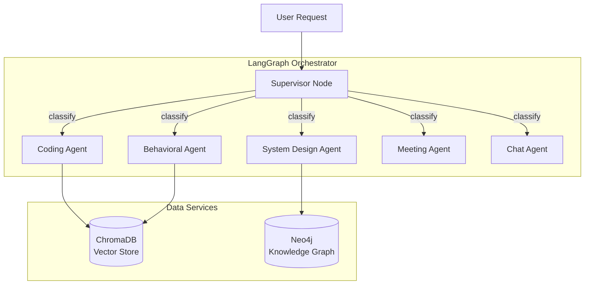

# Architecture

## Overview

Mac Interview Copilot is a privacy-first system that assists users during interviews by analyzing screen content and providing AI-powered coaching in real-time.

## System Components

```mermaid
graph TB
    subgraph Client["Mac Client (Swift)"]
        UI[ChatView / OverlayView]
        Hotkey[GlobalHotkeyManager]
        Screen[ScreenCaptureManager]
        OCR[OCRService]
        Stream[StreamingClient]
    end

    subgraph Mobile["Mobile Companion (React Native)"]
        MobileUI[Home Screen / Image View]
        SocketHook[useSocket Hook]
    end

    subgraph Backend["Backend (Node.js/Fastify)"]
        Gateway[API Gateway]
        SocketServer[Socket.IO Server]
        MCP[MCP Service Layer]
        subgraph Services
            Profile[ProfileService]
            Session[SessionService]
            AI[AIOrchestrator]
        end
        subgraph Providers
            Ollama[OllamaProvider]
            UnifiedImage[UnifiedImageProvider]
        end
    end

    subgraph Data["Data Layer"]
        Postgres[(PostgreSQL)]
        Redis[(Redis)]
        OllamaServer[Ollama Server]
        MLXServer[MLX Image Service (Python)]
    end

    UI --> Stream
    Hotkey --> UI
    Screen --> OCR
    OCR --> UI
    Stream -->|HTTP/SSE| Gateway
    Gateway --> MCP
    Gateway --> SocketServer
    MCP --> Services
    AI --> Providers
    Providers --> OllamaServer
    UnifiedImage -->|HTTP| MLXServer
    Profile --> Postgres
    Session --> Redis
    
    SocketServer -->|WebSocket (Stream/Images)| SocketHook
    SocketHook --> MobileUI
```

## Component Details

### 1. Mac Client (Swift)

| Component | Responsibility |
|-----------|----------------|
| **ChatView** | Main chat interface with message history |
| **OverlayView** | Floating window that appears on hotkey |
| **GlobalHotkeyManager** | Listens for `Cmd+Shift+Space` |
| **ScreenCaptureManager** | Captures screen regions |
| **OCRService** | Extracts text from images using Vision.framework |
| **StreamingClient** | Handles SSE connections to backend |

### 2. Backend (Node.js/TypeScript)

| Layer | Components |
|-------|------------|
| **API Gateway** | Fastify routes for auth, profile, session, AI |
| **MCP Server** | Model Context Protocol tools for AI |
| **Services** | ProfileService, SessionService, AIOrchestrator |
| **Providers** | Ollama, OpenAI, Anthropic adapters |

### 3. MCP Service Layer

The backend uses Model Context Protocol (MCP) to expose tools:

| Tool | Purpose |
|------|---------|
| `get_profile` | Retrieve user profile |
| `update_preferences` | Update user settings |
| `start_session` | Create new interview session |
| `add_message` | Store message in session |
| `get_history` | Retrieve session history |
| `behavioral_answer` | Get behavioral interview coaching |
| `coding_assist` | Get coding assistance |

### 4. Data Layer

| Store | Purpose |
|-------|---------|
| **PostgreSQL** | User profiles, session history (if enabled) |
| **Redis** | Active session cache, rate limiting |
| **Ollama** | Local LLM inference (llama3.2, deepseek, etc.) |

## Data Flow

```
1. User presses Cmd+Shift+Space
       │
       ▼
2. Overlay appears, user types question
       │
       ▼
3. Optional: User captures screen → OCR extracts text
       │
       ▼
4. Client sends POST /behavioral/answer or /coding/assist
       │
       ▼
5. Backend routes through MCP tools
       │
       ▼
6. AIOrchestrator selects provider (Ollama/OpenAI/Anthropic)
       │
       ▼
7. Provider streams response via SSE
       │
       ▼
8. Client displays streamed text in real-time
```

## Environment Configuration

```bash
# AI Provider Selection (priority: first configured wins)
OLLAMA_HOST=http://ollama:11434
OLLAMA_MODEL=llama3.2
OLLAMA_API_KEY=           # Optional, for remote Ollama

OPENAI_API_KEY=sk-...     # Optional
ANTHROPIC_API_KEY=sk-...  # Optional

# AI Framework Feature Flags (NEW)
USE_LANGGRAPH=true        # Enable multi-agent orchestration
USE_CHROMADB=true         # Enable RAG with interview examples
USE_NEO4J=true            # Enable user progress tracking

# Data Services
CHROMA_URL=http://localhost:8000
NEO4J_URI=bolt://localhost:7687
NEO4J_USER=neo4j
NEO4J_PASSWORD=interview123
```

## AI Framework Integration

The backend uses modern AI orchestration frameworks for enhanced capabilities:



### LangChain + LangGraph

| Component | Purpose |
|-----------|---------|
| **LLM Providers** | Unified factory for Ollama, OpenAI, Anthropic |
| **Chain Templates** | Pre-built chains for behavioral, coding, case interviews |
| **Supervisor Node** | Classifies requests into agent types |
| **Specialized Agents** | CODING, BEHAVIORAL, SYSTEM_DESIGN, MEETING, CHAT |

### ChromaDB (Vector Store)

| Collection | Content |
|------------|---------|
| `interview_questions` | Behavioral Q&A with STAR format examples |
| `coding_patterns` | LeetCode patterns (Two Sum, Sliding Window, etc.) |
| `user_sessions` | Historical session context |
| `company_guides` | Company-specific interview tips |

### Neo4j (Knowledge Graph)

| Capability | Description |
|------------|-------------|
| **Practice Tracking** | Records user performance on question types |
| **Weak Area Detection** | Identifies topics needing more practice |
| **Concept Relationships** | Maps related interview concepts |
| **Progress Summary** | Aggregates user's interview journey |

## Security

| Aspect | Implementation |
|--------|----------------|
| **Authentication** | JWT tokens with configurable secret |
| **API Keys** | Environment variables, never in code |
| **Privacy Mode** | Session history can be disabled |
| **Permissions** | Screen Recording & Microphone via TCC |

## File Structure

```
ai-manager/
├── backend/
│   ├── src/
│   │   ├── gateway/          # API routes
│   │   ├── services/         # Business logic
│   │   │   ├── ai-orchestrator/
│   │   │   ├── mcp/          # MCP client
│   │   │   ├── profile/
│   │   │   └── session/
│   │   ├── mcp-server/       # MCP tool definitions
│   │   │   └── tools/
│   │   └── config/           # Environment config
│   └── tests/
├── client-mac/
│   └── MacInterviewCopilot/
│       ├── App/              # App entry point
│       ├── Features/         # UI views
│       └── Core/
│           ├── Networking/   # API client
│           └── SystemIntegration/
├── infra/
│   └── docker-compose.dev.yml
├── scripts/
├── docs/
├── RUNBOOK.md               # Complete usage guide
└── rest.http                # API test requests
```

---

## Phase 2 Modules (Optional)

The following modules are available but not part of the core Mac + Backend deployment:

### Mobile Companion (`client-mobile/`)

| Aspect | Details |
|--------|---------|
| **Purpose** | React Native app for viewing AI responses and generated diagrams on phone |
| **Connection** | Socket.IO WebSocket to backend (auto-reconnecting) |
| **Status** | Production-ready, hardened hook implementation |
| **Features** | Real-time text streaming, Out-of-band image display (base64) |
| **Requirements** | Expo Go on phone, same WiFi network |

### MLX Image Service (`mlx-image-service/`)

| Aspect | Details |
|--------|---------|
| **Purpose** | Local image generation using Apple MLX (FLUX.1-schnell model) |
| **Endpoints** | Diagrams, flashcards, visualizations |
| **Status** | Integrated, GPU-accelerated on Apple Silicon |
| **Delivery** | Images broadcast via WebSocket to Mobile Companion (bypassing LLM context) |
| **Fallback** | Gemini API if MLX unavailable |

These modules can be enabled via:
- `make run-mobile` - Start mobile companion
- `make mlx-setup && make mlx-start` - Start MLX image server
