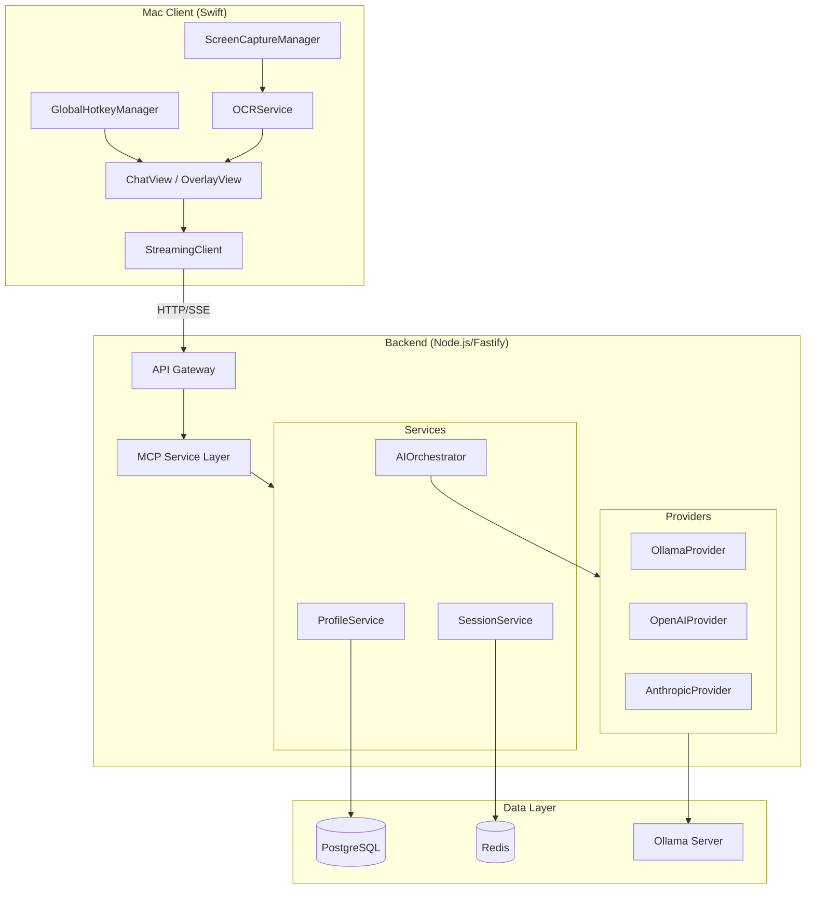

# Architecture

## Overview

Mac Interview Copilot is a privacy-first system that assists users during interviews by analyzing screen content and providing AI-powered coaching in real-time.

## System Components



## Component Details

### 1. Mac Client (Swift)

| Component | Responsibility |
|-----------|----------------|
| **ChatView** | Main chat interface with message history |
| **OverlayView** | Floating window that appears on hotkey |
| **GlobalHotkeyManager** | Listens for `Cmd+Shift+Space` |
| **ScreenCaptureManager** | Captures screen regions |
| **OCRService** | Extracts text from images using Vision.framework |
| **StreamingClient** | Handles SSE connections to backend |

### 2. Backend (Node.js/TypeScript)

| Layer | Components |
|-------|------------|
| **API Gateway** | Fastify routes for auth, profile, session, AI |
| **MCP Server** | Model Context Protocol tools for AI |
| **Services** | ProfileService, SessionService, AIOrchestrator |
| **Providers** | Ollama, OpenAI, Anthropic adapters |

### 3. MCP Service Layer

The backend uses Model Context Protocol (MCP) to expose tools:

| Tool | Purpose |
|------|---------|
| `get_profile` | Retrieve user profile |
| `update_preferences` | Update user settings |
| `start_session` | Create new interview session |
| `add_message` | Store message in session |
| `get_history` | Retrieve session history |
| `behavioral_answer` | Get behavioral interview coaching |
| `coding_assist` | Get coding assistance |

### 4. Data Layer

| Store | Purpose |
|-------|---------|
| **PostgreSQL** | User profiles, session history (if enabled) |
| **Redis** | Active session cache, rate limiting |
| **Ollama** | Local LLM inference (llama3.2, deepseek, etc.) |

## Data Flow

```
1. User presses Cmd+Shift+Space
       │
       ▼
2. Overlay appears, user types question
       │
       ▼
3. Optional: User captures screen → OCR extracts text
       │
       ▼
4. Client sends POST /behavioral/answer or /coding/assist
       │
       ▼
5. Backend routes through MCP tools
       │
       ▼
6. AIOrchestrator selects provider (Ollama/OpenAI/Anthropic)
       │
       ▼
7. Provider streams response via SSE
       │
       ▼
8. Client displays streamed text in real-time
```

## Environment Configuration

```bash
# AI Provider Selection (priority: first configured wins)
OLLAMA_HOST=http://ollama:11434
OLLAMA_MODEL=llama3.2
OLLAMA_API_KEY=           # Optional, for remote Ollama

OPENAI_API_KEY=sk-...     # Optional
ANTHROPIC_API_KEY=sk-...  # Optional
```

## Security

| Aspect | Implementation |
|--------|----------------|
| **Authentication** | JWT tokens with configurable secret |
| **API Keys** | Environment variables, never in code |
| **Privacy Mode** | Session history can be disabled |
| **Permissions** | Screen Recording & Microphone via TCC |

## File Structure

```
ai-manager/
├── backend/
│   ├── src/
│   │   ├── gateway/          # API routes
│   │   ├── services/         # Business logic
│   │   │   ├── ai-orchestrator/
│   │   │   ├── mcp/          # MCP client
│   │   │   ├── profile/
│   │   │   └── session/
│   │   ├── mcp-server/       # MCP tool definitions
│   │   │   └── tools/
│   │   └── config/           # Environment config
│   └── tests/
├── client-mac/
│   └── MacInterviewCopilot/
│       ├── App/              # App entry point
│       ├── Features/         # UI views
│       └── Core/
│           ├── Networking/   # API client
│           └── SystemIntegration/
├── infra/
│   └── docker-compose.dev.yml
├── scripts/
├── docs/
├── RUNBOOK.md               # Complete usage guide
└── rest.http                # API test requests
```
